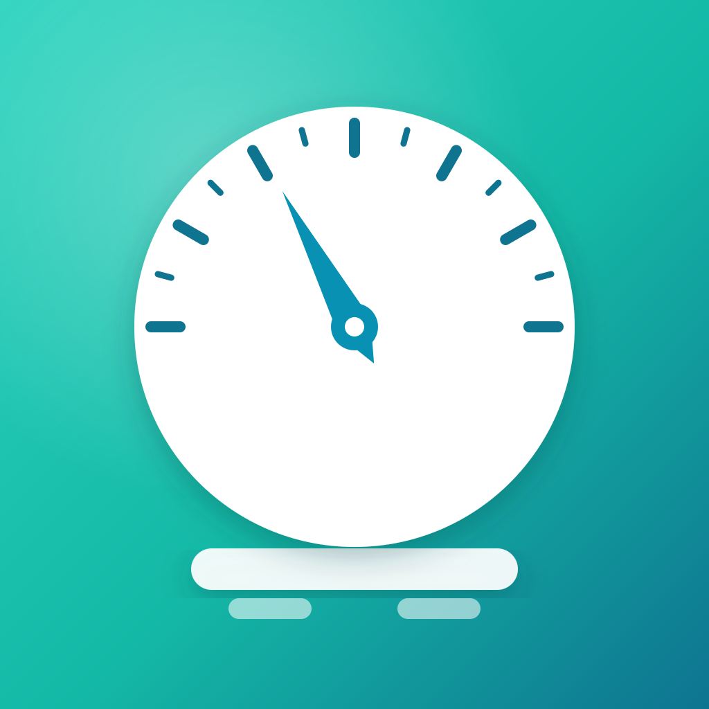

<div align="center">



# LibreBase

**An independent, open-source iOS app that connects your QardioBase smart scale to Apple Health.**

When Qardio Inc. shut down in 2025 — app delisted, servers dark — the scales kept working over Bluetooth. LibreBase is a small SwiftUI client that talks to the scale directly and logs your weight into HealthKit, so your data never depends on a vendor again.


</div>

---

## Features

- **Direct Bluetooth LE** connection to the QardioBase — no account, no cloud, no Qardio app required.
- **Automatic weigh-in.** Step on the scale; the reading appears and is saved to Apple Health.
- **Apple Health integration.** Weight is written to HealthKit's Body Mass.
- **In-app BMI** computed from your height (read from and synced back to Apple Health), with a unit-aware picker. The scale's own BMI is deliberately *not* used — see [BMI & units](#bmi--units).
- **Locale-aware units.** Weight shows kg or lb, height shows cm or ft/in, based on your region. Canonical metric values are always what's stored in Health.
- **Battery and connection status** at a glance, with a one-tap reconnect.
- **Recon mode** — an optional BLE capture log for inspecting the scale's GATT services and payloads, useful for supporting new hardware.

## Requirements

- iPhone running iOS 26.5 or later.
- A QardioBase smart scale. Tested against the original **QardioBase (B100)**; QardioBase 2 / X are untested — see [Supported hardware](#supported-hardware).
- To build and run on a device: Xcode 26+ and an Apple Developer account (HealthKit requires a provisioned device, not the simulator, for real data).

## Build & run

```bash
git clone https://github.com/stormychel/LibreBase.git
cd LibreBase/iOS
open LibreBase.xcodeproj
```

1. Select the **LibreBase** scheme and your device.
2. Set your own signing team (Signing & Capabilities → Team). The bundle id is `com.michelstorms.LibreBase`; change it to your own.
3. Build and run. On first launch, grant the Bluetooth and Health permissions when prompted.
4. Step on the scale.

## How it works

The app is intentionally small — three types:

| File | Responsibility |
|------|----------------|
| `ScaleClient.swift` | CoreBluetooth: scans for the scale, connects, discovers services, parses weight, and exposes connection/battery state. |
| `Health.swift` | A thin HealthKit wrapper: authorization, saving weight, and reading/writing height. |
| `ContentView.swift` | The single SwiftUI screen: live reading, BMI, height picker, toggles, and recon log. |

### Reading weight

The QardioBase is discovered by name and advertised service, then connected. LibreBase reads the weight from whichever of two paths the unit exposes:

1. **Standard BLE Weight Measurement** (`0x2A9D`) — the SIG-spec'd payload, normalized to kilograms (handling the imperial flag).
2. **Qardio proprietary result** — after the scale signals "done", LibreBase reads characteristic `B24F98BE-…`, which returns a plain-JSON final measurement.

In both cases weight is normalized to **kilograms internally** and only converted for display.

### BMI & units

BMI is **computed in-app**, never taken from the scale. The scale can only report BMI if it knows your height, and that height could previously only be set through the now-discontinued Qardio app — so for most users it is stale, belongs to another person, or is absent entirely. Instead, LibreBase:

- reads your height from Apple Health to seed the value automatically,
- lets you adjust it with a wheel picker (cm, or ft/in by locale), and
- writes any edit back to Health, so the two never diverge.

BMI is then `weight / height²`, shown only once a height is known.

### Recon mode

Toggling **Recon mode** makes the client discover *every* service and characteristic and log each payload as hex. This is how the protocol below was mapped, and it's the starting point for adding support for other models.

## Privacy

LibreBase has no servers, no analytics, and no network code. Everything happens on-device over Bluetooth and through HealthKit. Your weight and height never leave your phone except where *you* sync HealthKit via iCloud. The app declares `ITSAppUsesNonExemptEncryption = false` (it uses no encryption beyond the OS).

## Supported hardware

| Model | Status |
|-------|--------|
| QardioBase (B100) | ✅ Tested — weight → Health works |
| QardioBase 2 | ❓ Untested — likely similar profile |
| QardioBase X | ❓ Untested — newer/rechargeable, may differ |

Body composition (fat %, water, muscle, bone) is present in the scale's JSON but **not yet parsed or saved** — see the roadmap.

## Roadmap

- Parse and save **body composition** (bioimpedance → fat %, lean mass) to HealthKit.
- Verify and broaden **QardioBase 2 / X** support.
- Weigh-in history view in-app.
- Contribute a **QardioBase driver to [openScale](https://github.com/oliexdev/openScale)** on the Android side.

## Contributing

Issues and PRs welcome — especially capture logs from a QardioBase 2 or X (use Recon mode and paste the log). If you're adding a model or decoding body composition, the [protocol notes](#appendix-reverse-engineering-notes) below are the place to start.

## License

[MIT](LICENSE) © Michel Storms. Note: [openScale](https://github.com/oliexdev/openScale) is GPL — treat its impedance formulas as a *reference*, not copy-paste, in this permissively-licensed app.

## Acknowledgements

- **LibreArm** — the open-source QardioArm revival that proved the approach (BLE reverse-engineering + HealthKit, approved on the App Store as a wellness app).
- **[openScale](https://github.com/oliexdev/openScale)** (oliexdev) — the reference open-source scale project and its "how to support a new scale" workflow.
- **Nordic nRF Connect / nRF Sniffer** and Apple **PacketLogger** — the BLE recon and capture tooling.

---

## Appendix: reverse-engineering notes

These are the findings behind the implementation, kept for anyone supporting new hardware or decoding body composition.

### QardioBase B100 GATT profile

The tested unit does **not** expose the standard Weight Scale (`0x181D`) or Body Composition (`0x181B`) services. It exposes Device Info, Battery, and a custom Qardio service:

| UUID | Meaning observed |
|------|------------------|
| `A78AF805-8F3F-4E8F-A964-318B768BC38C` | control/state notify: `00` idle, `03` measuring, `06` done |
| `9F3F4E1B-37D7-4F95-B374-CF585D808BEB` | noisy engineering/debug stream; also accepts config write `00 00 01 01` |
| `B24F98BE-9CD4-4F82-B935-01F18F104EDE` | final measurement JSON; read after state `06` |
| `1EC92A15-14E0-43E7-A990-CB37000990BA` | calibration JSON |

### Final measurement JSON

After state `06`, reading `B24F98BE-…` returns plain UTF-8 JSON. This is the reliable source LibreBase uses (only `weight` is consumed today):

```json
{"weight":"76.0","bmi":"19.3","z":"2031","fat":"57","tbw":"31","bmc":"3","mt":"9","sm":"17"}
```

`fat`, `tbw` (total body water), `bmc` (bone mineral content), `mt`, `sm` (skeletal muscle) are the body-composition fields awaiting a parser. The scale-provided `bmi` is ignored (see [BMI & units](#bmi--units)).

### Decoding the engineering stream (optional)

You do **not** need this if you read the JSON, but for reference: the `9F3F…` stream carries raw load-cell frames, and `1EC9…` exposes calibration:

```json
{"0":"0","50":"5945","100":"11888","150":"17836","z":"523"}
```

That's ≈ `118.907` raw counts per kg, with `z` a millikilogram offset (`523` → `+0.523 kg`). A known-good frame for an expected `87.4–87.7 kg` weigh-in:

```text
21 70 28 10
raw = littleEndian(bytes[1...2]) = 0x2870 = 10352
kg  = raw / 118.907 + 0.523 = 87.6 kg
```

Many of the engineering stream's 16-bit windows are false positives and can repeat between users — prefer the JSON characteristic.

### Capturing a new device

1. Enable **Recon mode** in the app and step on the scale — the log shows every service, characteristic, and payload.
2. For deeper captures, an **nRF52840 dongle + nRF Sniffer** (into Wireshark, filter `btatt`) records the live link with best fidelity.
3. Note your exact model and serial; QardioBase 2 / X may differ in services or firmware.

> Reverse-engineering hardware you own from a defunct vendor for interoperability is broadly defensible, but this is engineering documentation, not legal advice.
